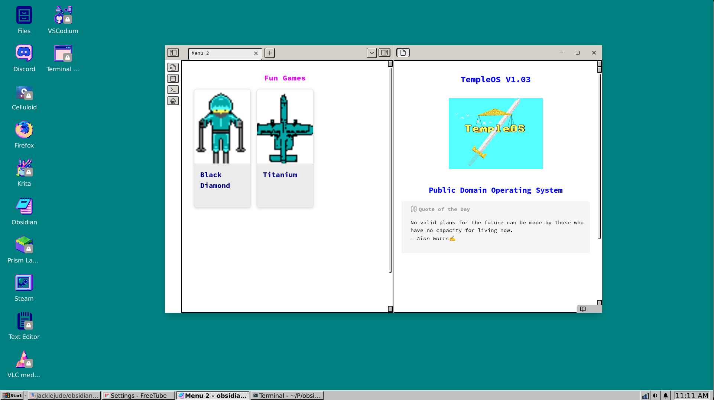

# [NixOS-95](https://github.com/Peritia-System/NixOS-95) but only the theme

*Just the theme, no system config*

- Forked from [Peritia-System/NixOS-95](https://github.com/Peritia-System/NixOS-95)
- See original for full system config

---


- NixOS-95 and [Obsidian Temple OS](https://github.com/jackiejude/obsidian-temple-os)

## 🖥️ System Overview

* **OS**: NixOS
* **DE**: XFCE (customized)
* **GTK Theme**: [Chicago95](https://github.com/grassmunk/Chicago95)
* **Icons & Wallpapers**: [aconfuseddragon](https://aconfuseddragon.itch.io/)

---

## 📁 Directory Overview

<details>
<summary>tree .</summary>

```bash
NixOS-95/
├── default.nix
├── home.nix
├── README.md
├── user-vars.nix
├── Ressources
│   ├── Icons
│   ├── Images
│   ├── Showcase
│   └── Themes
└── XFCE-retro
    ├── default.nix
    └── Dotfiles

```

</details>

---

### Wallpaper and Aesthetics

Wallpapers are located in `./Resources/Images/Wallpapers`.  
Some have been lightly edited. Originals were created by [aconfuseddragon](https://aconfuseddragon.itch.io/downloads).  

---

## Installation

> Requires a NixOS install.

1. **Clone the repository**:

```bash
git clone --depth 1 https://github.com/jackiejude/NixOS-95
```

2. **Modify your config to import NixOS-95**:

```nix
imports = [ ./NixOS-95 ]
```

3. Update the users-vars.nix file with your username

```nix
let
  username = "jackie";
in {
  inherit username;
}
```

4. Symlink home.nix

```bash
mkdir -p ~/.config/home-manager/
ln -s ~/NixOS-95/home.nix ~/.config/home-manager/home.nix
```

4. **Build and switch to the system configuration**:

5. **Apply user settings with Home Manager**:

```bash
home-manager switch
```

### Rebuild Notes

Due to how **Home Manager** and XFCE handle theming, changes may not fully apply on the first attempt.

**For best results:**

1. Rebuild twice
2. Log out and back in after each rebuild

---

## Features

* Pixel-style retro desktop with pastel polish
* Lightweight and XFCE-powered (great for low-spec machines)
* Themed with Chicago95 and matching icon set
